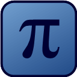
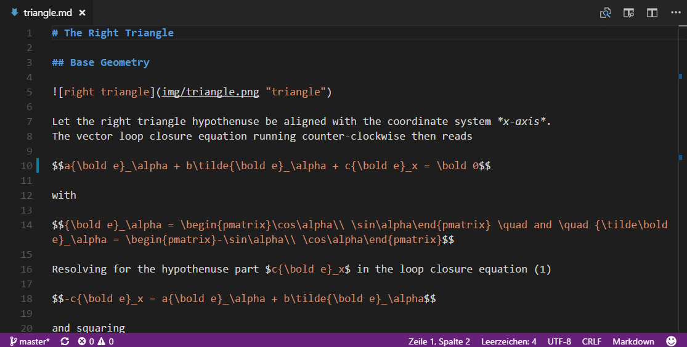

#  Markdown+Math

[](https://marketplace.visualstudio.com/items?itemName=goessner.mdmath)
[](https://marketplace.visualstudio.com/items?itemName=goessner.mdmath)
[](https://github.com/goessner/mdmath/blob/master/LICENSE.txt)
[](https://www.npmjs.com/package/mdmath)

## What is it ...

**mdmath** allows to use *Visual Studio Code* as a markdown editor capable of typesetting and rendering TeX math.
In fact it now reuses the built in markdown viewer. KaTeX works inside as a fast math renderer.

You can install the extension directly from [Visual Studio Code Marketplace](https://marketplace.visualstudio.com/items?itemName=goessner.mdmath).

## Features
Simplify the process of authoring and live previewing markdown documents containing math formulas.
This extension is a comfortable tool for scientists, engineers and students with markdown as their first choice 
document format.

* Inline math
* Display math
* Formula numbering
* Inline math with tables
* Export resulting HTML code for web usage


### What is new in **mdmath** 2.0 ...
* Integrated in native markdown viewer. So after installing the extension, TeX math is properly displayed in the markdown preview window.
* Based on [markdown-it](https://github.com/markdown-it/markdown-it) plugin [markdown-it-texmath](https://github.com/goessner/markdown-it-texmath).
* Using vscode's [Markdown Extension API](https://code.visualstudio.com/docs/extensionAPI/api-markdown).
* Editor view and Preview are synchronized while scrolling.
* Heavily reduced code size.
* Works offline.
* Due to [markdown-it-texmath's](https://github.com/goessner/markdown-it-texmath) support of different formula delimiters, these are also available and user configurable with mdmath:
  * `dollars` (default)
    * inline  `$...$`
    * display `$$...$$`
  * `brackets`
    * inline  `\(...\)`
    * display `\[...\]`
  * `gitlab`
    * inline ``$`...`$``</code>
    * display ` ```math ... ``` `

* The former [test table](https://goessner.github.io/markdown-it-texmath/index.html) was moved to [markdown-it-texmath](https://github.com/goessner/markdown-it-texmath).
* Support of Table of contents (ToC) and footnotes removed. Use other extensions instead.
* **Breaking Change:** Before and after display formulas empty lines are required.
* **Breaking Change:** Math formulas in code sections not supported.



## Installation ...

### ... from inside of VSCode

Press <kbd>F1</kbd> key inside of *Visual Studio Code* and type `extension`. Choose `Extensions: Install Extension` 
and then select the `Markdown+Math` extension from the list.

### ... from Mac & Linux Command Line
```
cd $HOME/.vscode/extensions
git clone https://github.com/goessner/mdmath.git
cd mdmath
npm install
```

### ... from Windows Command Line
```
cd  %USERPROFILE%\.vscode\extensions
git clone https://github.com/goessner/mdmath.git
cd mdmath
npm install
```

## Usage

* Launch *VS Code*, create or open a markdown file (`.md`).
* Open a preview window.
* Typeset in your markdown source window and see the preview window live updating.
* Press <kbd>Ctrl+K .</kbd> or run the command `Clip Markdown+Math to HTML` to copy the 
  corresponding HTML source to the underlying systems clipboard.

## Default User Settings
```json
  // Path to custom stylesheet file (css).
  "mdmath.delimiters": "dollars"
```

## Dependencies

* [`markdown-it`](https://github.com/markdown-it/markdown-it): The markdown renderer also used in VS Code.
* [`katex`](https://github.com/Khan/KaTeX): This is where credits for fast rendering TeX math in HTML go to.
* [`clipboardy`](https://github.com/sindresorhus/clipboardy): Access the system clipboard (copy/paste).

## FAQ

* __Formula highlighting is broken ?__
  * Math formula highlighting is experimental.
  * It is implemented only for `$` delimiters at present.
  * `$` characters in markdown text are sometimes confused with math delimiters. Enclose them by backticks (`) then.
  * Formula highlighting is possible only for formulas on a single line. It breaks with every newline character.
  * Math highlighting is completely different from LaTeX math parsing.
* __Which functions does KaTeX support ?__
  * See them listed at [KaTeX Reference](https://github.com/Khan/KaTeX/wiki/Function-Support-in-KaTeX).
* __What if I need to use the currency symbol `$` also in my markup ?__
  * It should be safe to use it. If in doubt escape it.
* __What are the restrictions with inline formulas ?__
  * Whitespace after opening `$` and before closing `$` is not allowed.
  * Numeric character before opening `$` and after closing `$` is not allowed.
  * At least one character (whitespace ?) is required between two consecutive inline formulas.
  * Line break inside is not allowed.
* __What are the restrictions with display formulas ?__
  * Not allowed inline of text.
  * Blank lines before and behind required.
  * Restrictions for inline formulas do not apply.
* __Can I use math markup in blockquotes ?__
  * We can use inline and display formulas in blockquote sections. In order to avoid the blockquote symbol `'>'` being part of a multiline display formula, display formulas have to be written on a single line in blockquote sections.
* __Can I use math markup in code blocks ?__
  * No, math markup in code blocks is shown - as expected - as markup. This is consistent now, but in contrast to `mdmath` versions prior to 2.0.
* __Can I access the HTML source of the markdown file ?__
  * Yes. Use the <kbd>Markdown: Clip Markdown+Math to Html</kbd> command or the key binding (`'ctrl+K .'`). 
  * The markdown preview window has to be opened once for this in order to function properly.
  * You need to have the markdown source window activated here (not the preview window!). 
  * Please note, that the resulting HTML source references 'CDN'-located remote css files. Change those references to local URL's if necessary.
* __Is PDF output supported ?__
  * Not directly. In order to create `*.pdf` output from your Markdown you can create a `*.html` document first and print it then using a `PDF` printer or use [Pandoc](http://pandoc.org/).
  * See [Compiling Markdown into HTML](https://code.visualstudio.com/docs/languages/markdown).
* __Can I use custom CSS styles for the preview window ?__
  *  Yes. Set `mdmath.style` in user settings to the location of your custom CSS file. Its path must be relative to this extension root.
* __Cannot copy to clipboard on Linux ?__
  * This may be because the upstream `clipboardy` needs `xsel` on Linux. Run `sudo apt-get install xsel` to install.


## Thank You

The following folks helped to make `mdmath` even better.

* [lincr](https://github.com/LCAR979): Helped with fixing problems with `mdmath.clipToHtml` under Ubuntu.
* [TonySFU](https://github.com/TonySFU): Helped with fixing encoding problems with Chinese language under macOS when using `mdmath.clipToHtml`.
* [floatdrop](https://github.com/floatdrop): Verifying that [clipboardy](https://github.com/sindresorhus/clipboardy) is a better alternative to `copy-paste` by implementing.
* [zhanglix](https://github.com/zhanglix): Helped with fixing the `newline` bug with `gitlab` delimiters.

## Contributing

See [`.github/CONTRIBUTING.md`](.github/CONTRIBUTING.md)

## Changelog

See [`changelog.md`](changelog.md)

## License

*Markdown+Math* for VS Code is licensed under the [MIT License](http://opensource.org/licenses/MIT)

 © [Stefan Gössner](https://github.com/goessner)
